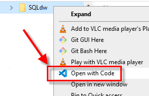

# SQL and default DB (Adventure Works DW)
Container that runs SQL Server on Linux (Platform: linux, x86_64, name=ubuntu, version=16.04 (Ubuntu16)) using the base image: [microsoft/mssql-server-linux](https://hub.docker.com/r/microsoft/mssql-server-linux), i.e Microsoft MSSQL Server 2017 for Linux Docker Edition and provides a default database

## The Dockerfile
The Dockerfile uses the base image [microsoft/mssql-server-linux](https://hub.docker.com/r/microsoft/mssql-server-linux) and does three things:

1. Updates some OS commands like "apt-get" and certificates
2. Copies the custom scripts that will download (wget) the .bak database and creates a simple db
3. Updates the entrypoint.sh to run the custom scripts from step 2.

## The "scripts" directory
This directory ./scripts/ contains all the scripts to download sample databases (AdventureWorks, WorldWide Imports), and creates a simple one (demodata)

1. **entrypoint.sh**: This script calls subsequent other scripts i.e run-initialization.sh but more importantly it also starts the SQLServer database
2. **run-initialization.sh**: This script performs "wget" and execute two other scripts create-db.sql and restoreAdvWkrs.sql  
3. **create-db.sql**: Creates a simple table "demodata"
4. **restoreAdvWrks.sql**: AdventureWorks database backup
5. **restoreWWI.sql**: World Wide Imports database backup

## The "PowerBI" directory
1. **AdventureWorksDW_ER.pdf**: This is the entity relationship data model for the Adventureworks database
2. **AWS_InternetSales.pbix**: This is the PowerBI report that only models the star schema for the Internet Sales fact table

## The Image and Container
To get your container created and running you will have to execute the following commands in the order indicated:
### Create the Image
``` bash
$ docker build -t sqldwimage .
```

### Create the Container
``` bash
$ docker-compose up -d
```

### VS-Code: Container creation

Use VS-Code and add the cloned git repo into your workspace. 


Add the folder into VS-Code



Click on **docker-compose.yml** and run the "docker-compose up" command


### Verify DB is up and running
Switch to Docker view and inspect the log output


You should initially see this log messages

>2021-04-03 18:15:10.33 spid24s     The Database Mirroring endpoint is in disabled or stopped state.<p>
2021-04-03 18:15:10.34 spid24s     Service Broker manager has started.<p>
2021-04-03 18:15:10.43 spid6s      Recovery is complete. This is an informational message only. No user action is required.<p>
2021-04-03 18:15:10.45 spid21s     The default language (LCID 0) has been set for engine and full-text services.<p>

Wait for about 1 or 2 minutes until you see the additional lines coming up. Only then the sql server instance and the AdventureWorksDW db is ready

>2021-04-03 18:16:35.21 spid51      Starting up database 'DemoData'.<p>
2021-04-03 18:16:35.39 spid51      Parallel redo is started for database 'DemoData' with worker pool size [1].<p>
2021-04-03 18:16:35.41 spid51      Parallel redo is shutdown for database 'DemoData' with worker pool size [1].<p>
Changed database context to 'DemoData'.<p>
2021-04-03 18:16:36.16 spid51      Starting up database 'AdventureWorksDW2017'.<p>
2021-04-03 18:16:36.34 spid51      The database 'AdventureWorksDW2017' is marked RESTORING and is in a state that does not allow recovery to be run.<p>

...

>2021-04-03 18:16:36.95 Backup      RESTORE DATABASE successfully processed 12171 pages in 0.292 seconds (325.615 MB/sec).<p>
Processed 12168 pages for database 'AdventureWorksDW2017', file 'AdventureWorksDW2017' on file 1.<p>
Processed 3 pages for database 'AdventureWorksDW2017', file 'AdventureWorksDW2017_log' on file 1.<p>
RESTORE DATABASE successfully processed 12171 pages in 0.292 seconds (325.615 MB/sec).<p>

#### Note
> As per the documentation, the base image [microsoft/mssql-server-linux](https://hub.docker.com/r/microsoft/mssql-server-linux) , which runs on linux/amd64 SQL Server 2017, is no longer updated since 2019.